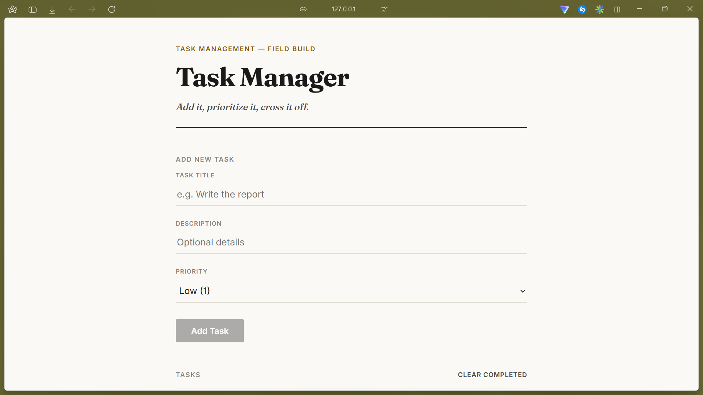
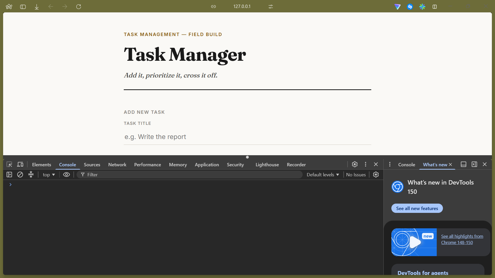
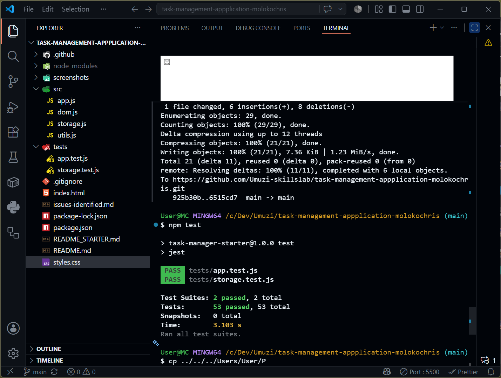
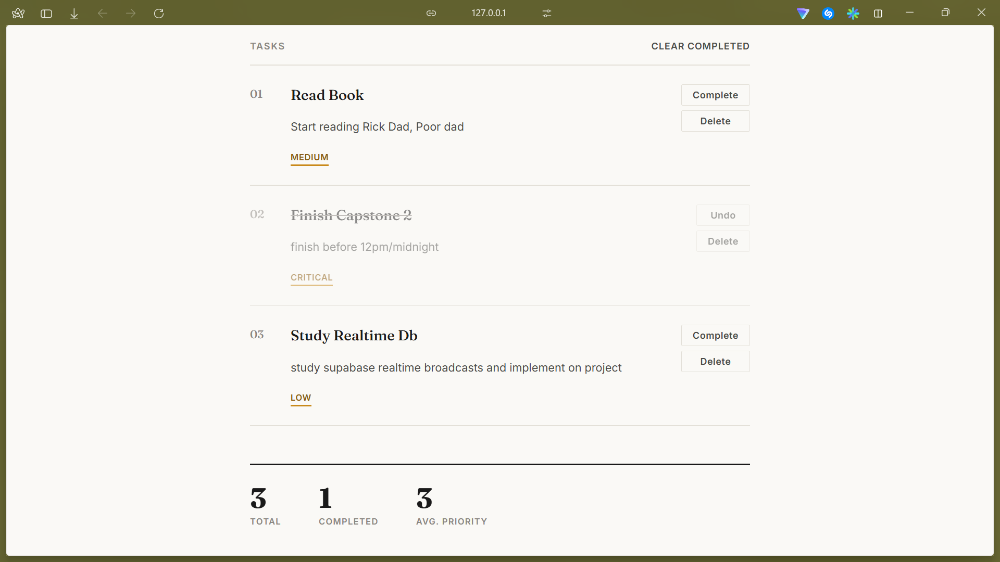

# Task Manager — JavaScript Capstone 2

A debugged, modernized task management app in vanilla JavaScript (ES6 modules). Fixes 49+ intentional errors in the starter code, completes every rubric requirement, and adds real functionality beyond the brief: subtasks, priority editing, filtering, JSON import, and an archive/restore undo.

## Overview

The starter code was ~60% complete: broken scoping, loop/operator bugs, missing OOP features, DOM errors, and two tests. This version has a fully working task manager with localStorage persistence and 73 passing Jest tests across two files.

## Errors Found (see `issues-identified.md` for the full list)

Covers Variables & Operators (implicit globals, `var`, `==`, assignment-in-conditional), Control Flow (off-by-one loop, infinite `while`, missing recursion base case), Functions & OOP (missing parameter, no validation, missing `super()`, stale `TaskManager.tasks` snapshot), Modern JS (no template literals/destructuring/spread/rest, no ES6 modules at all), DOM (wrong selectors, no null checks, unescaped user input), and Testing (no imports, no `beforeEach`, only 2 tests).

## Core Fixes

- **Modules:** every file uses real `import`/`export`; `index.html` loads one `<script type="module">`.
- **Core JS:** `var`/`==`/assignment-in-conditional removed; destructuring, spread/rest, a higher-order function (`createTaskFilter`).
- **OOP:** `Task`/`SubTask` with `super()` and a real method override; `TaskManager` as a live facade.
- **Accessibility & security:** semantic `<form>`/`<label>`s, `aria-live`/`aria-pressed`/`aria-label`, and `escapeHTML()` before `insertAdjacentHTML` (closes a stored-XSS gap in the original code).
- **Code quality:** removed a duplicate localStorage implementation; `styles.css` rewritten from scratch (the original selectors never matched the markup); a genuinely unique task ID generator (was collision-prone `Date.now() + Math.random()`).
- **Design:** an original "editorial minimal" visual identity (Fraunces serif, single amber accent, numbered task index, pull-quote stats).

## Additional Features

Beyond the required add/complete/delete/persist flow:
- **Subtasks** — optionally attach a new task to an existing one via the "Parent task" field; `SubTask` overrides `getInfo()` to include the parent's title.
- **Priority editing** — click a task's priority badge to cycle it (1→5, wraps to 1).
- **Up Next** — the masthead shows the next pending task and how many are behind it.
- **High-priority filter** — toggle the task list to priority 4+ only.
- **Find a task** — exact-title lookup that scrolls to and highlights the match.
- **Import tasks (JSON)** — batch-create tasks from a file via a rest parameter (`createTasks(...parsed)`).
- **Clear Completed / Restore** — clearing archives tasks instead of deleting them; "Restore" undoes it (`mergeTasks` recombines the two arrays).
- **Clear All Data** — confirmation-gated full reset, including localStorage.

## Running the App

```bash
npm install
npx serve .
```
Open the printed local URL. (ES6 modules need an HTTP server — `file://` will fail due to browser module CORS restrictions.)

## Running Tests

```bash
npm test
```
**Result: 73 passed, 0 failed** across `tests/app.test.js` (Task/SubTask, every app.js function, recursion edge cases, destructuring/spread/rest, archive/restore, utils.js helpers) and `tests/storage.test.js` (save/load/clear against a mocked `localStorage`).

## Screenshots

**Application running**


**Console — no errors**


**Jest test results**


**DOM manipulation — add / complete / undo / delete, live stats**


## Reflection

The trickiest bug was `TaskManager.tasks` being assigned once at creation instead of exposed as a getter — it silently never reflected new tasks. The biggest lesson from the second pass: several functions (`mergeTasks`, `findTaskByTitle`, `createTaskFilter`) were written, tested, and exported, but never actually called by the running app — technically passing, not actually done. Wiring them into real features (archive/restore, search, filtering) closed that gap.

---
**Author:** Moloko Chris Poopedi | Capstone 2
